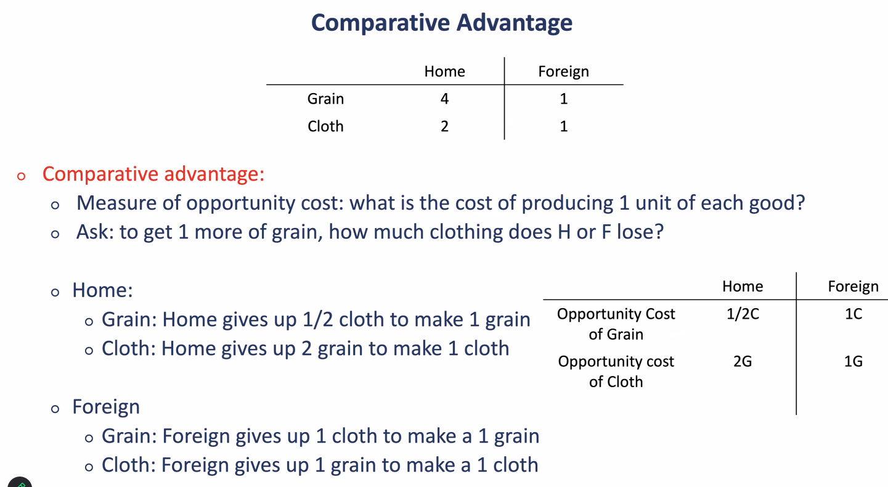

# Lecture 4 - Comparative Advantage

How can trade deliver increases in productivity

## Zero-sum thinking

- Images of limited goods
- Gains of one -> losses of another
- Societal output is limited
- Mere reallocation of value

## Why does the US import snowboards from so many countries

- Differences in quality, price, historical reasons, global value chains, capacity constraints

## Ricardo's ideas

- Absolute advantage
- Comparative advantage

## Trade model

H: L=25
F: L=100

Two goods (clothing and grain)

Perfectly competitive markets

H production: 4 bushels or 2 yards of cloth
F production: 1 bushel or 1 yard of cloth

Comparative advantage works with opportunity costs

Trade is kind of a technology as it improves the productivity of the thing that you're producing and then selling -> your consumption frontier expands (based on price), although the production frontier stays the same
