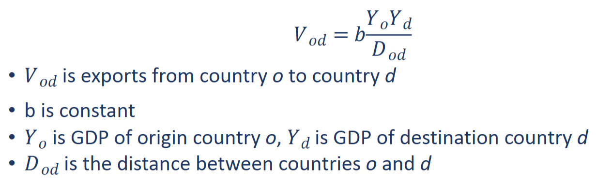

# Lecture 8

## Law of gravity in physics

- Attraction between two objects declines with distance and increases with mass

## LoG in economics

- Commercial trade declines with the distance and increases with the size
- Log: $lnV_{od} = lnb+lnY_oY_d-lnD_{od}$
- Strict version: $lnV_{od} = lnY_oY_d-lnD_{od} = lnIndex_{od}$

Distance is an important predictor of declining trade, as it picks up on other things that play a role besides distance itself (similarness of culture, legal regimes, existing trade agreements (which usually only reinforce existing positive regional economic relations))

- CAGE
  - Cultural
  - Administrative
  - Geographic
  - Economic
